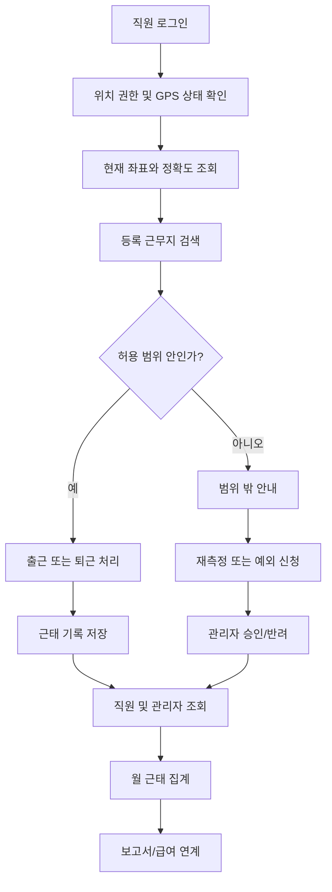

# GPS 지오펜스 기반 출퇴근 관리 시스템 구현 명세서

> **문서 성격**: 이 문서는 프로젝트 착수 시점에 작성한 최초 요구사항·설계 명세서다. MVP(1~5단계)는
> 구현이 완료되었고, 그 과정에서 이 문서에 없던 개념(권한레벨 `LEVEL_ROLL`, 근무지/근무제 변경요청과
> 그 승인 흐름, 관리자웹 권한관리 화면 등)이 추가되었다. 정확한 최신 기능 목록·API 경로·DB 스키마는
> 코드와 [`README.md`](../README.md)의 "개발 현황"을 기준으로 확인하고, 이 문서는 전체 설계 의도와
> 배경을 이해하는 참고 자료로 사용한다. 아래 3장(사용자 역할)과 9장의 테이블 목록·9.2/9.4/9.5절은
> 실제 구현 기준으로 갱신했고, 나머지 장(API 경로·에러 코드·의사코드 등)은 최초 설계 의도를 그대로
> 남겨 두었다.

## 1. 문서 목적

본 문서는 GPS 위치와 지오펜스(Geofence)를 이용한 출퇴근 관리 시스템을 구현하기 위한 요구사항과 설계 기준을 정의한다.

시스템은 다음 두 영역으로 구성한다.

- **직원용 모바일 앱**
  - GPS 기반 출근·퇴근 처리
  - 근무기록 조회
  - 근태 수정 요청
  - 휴가·외근·출장·재택근무 신청
- **관리자용 웹**
  - 근무지 및 GPS 허용 범위 관리
  - 직원·조직·근무제 관리
  - 근태 조회 및 보정
  - 신청 승인
  - 통계 및 보고서

---

## 2. 구축 범위

### 2.1 MVP 범위

#### 직원용 앱

- 로그인 및 토큰 재발급
- 현재 위치 조회
- 출근 처리
- 퇴근 처리
- 오늘 근무상태 조회
- 일별·월별 근태 조회
- 근태 수정 요청
- 신청 상태 조회
- 알림 조회

#### 관리자용 웹

- 관리자 로그인
- 대시보드
- 직원 및 조직 관리
- 근무지 관리
- GPS 허용 반경 설정
- 근무제 관리
- 일별·월별 근태 조회
- 근태 수동 보정
- 근태 수정 요청 승인·반려
- 엑셀 다운로드
- 감사 로그 조회

### 2.2 고도화 범위

- 외근·출장·재택근무 신청 및 승인
- 휴가 관리
- 연장·야간·휴일근무
- 복수 근무지
- 임시 근무지
- QR·Wi-Fi·BLE 비콘 보조 인증
- GPS 조작 탐지
- 급여 시스템 연계
- 푸시 알림
- 이상 근태 자동 탐지
- 근태 마감 및 재마감

---

## 3. 사용자 역할

실제 구현에서는 아래 두 축을 함께 사용한다.

### 3.1 역할(`role`) — API 인가 축

| 역할 | 코드 | 주요 권한 |
|---|---|---|
| 직원 | EMPLOYEE | 본인 출퇴근, 근태 조회, 수정·휴가·외근 신청 |
| 팀 관리자 | MANAGER | 소속 조직 근태 조회, 1차 승인 |
| 인사 관리자 | HR_ADMIN | 전체 직원·근태·휴가·근무제 관리 |
| 시스템 관리자 | SYSTEM_ADMIN | 계정, 권한, 환경설정, 감사 로그 관리 |

### 3.2 권한레벨(`level`, 공통코드 그룹 `LEVEL_ROLL`) — 조회 범위 축

역할과 별도로, 조직 계층상 직책을 나타내는 권한레벨을 둔다. 화면별 **조회 범위**(본인만 /
본인+하위조직 / 전체)와 관리자웹 메뉴·기능 표시 여부가 이 값으로 결정된다. 레벨 코드와 표시순서는
관리자웹 **권한관리** 화면에서 공통코드로 관리하며, 기본 구성은 다음과 같다(표시순서가 낮을수록
상위 직책).

| 코드 | 설명 |
|---|---|
| SYSADMIN | 시스템관리자 |
| PRESIDENT | 사장 |
| HRADMIN | 인사담당자 |
| DIVHEAD | 부문장 |
| HQHEAD | 본부장 |
| OFFICEHEAD | 실장 |
| TEAMLEAD | 팀장 |
| PARTLEAD | 파트장 |
| EMPLOYEE | 직원 |

- SYSADMIN/PRESIDENT/HRADMIN: 조직 범위 제한 없이 전체 조회.
- DIVHEAD~PARTLEAD("파트장 이상"): 본인 조직 및 하위조직 전체 조회.
- EMPLOYEE: 본인 데이터만 조회.

### 권한 원칙

- 직원은 본인 정보만 조회한다.
- 파트장 이상 권한레벨은 본인 소속 조직 및 하위조직만 조회한다.
- 관리자에 의한 근태 변경은 변경 전후 값을 기록한다.
- 위치정보는 업무상 필요한 최소 범위만 노출한다.

---

## 4. 전체 업무 흐름



---

## 5. 권장 시스템 구성

### Backend

- Java 17
- Spring Boot 3.x
- Spring Security
- JWT Access Token / Refresh Token
- Spring Data JPA
- PostgreSQL 또는 MySQL
- Redis 선택
- Gradle

### 관리자 웹

- React 또는 Vue
- TypeScript
- Kakao Maps, Naver Maps 또는 Google Maps

### 직원 앱

- Flutter
- React Native
- Android/iOS 네이티브

### 인프라

- Docker
- Nginx 또는 API Gateway
- HTTPS 필수
- 로그 수집 및 모니터링

---

## 6. 직원용 앱 메뉴

## 6.1 로그인

### 입력 항목

- 회사 코드
- 사번 또는 이메일
- 비밀번호

### 기능

- 로그인
- 비밀번호 재설정
- 자동 로그인
- 생체인증 선택
- 기기 등록
- 위치정보 수집 동의

---

## 6.2 홈

### 표시 항목

- 사용자명 및 소속
- 현재 날짜·시간
- 현재 근무지
- 근무지와의 거리
- GPS 정확도
- 오늘 출근·퇴근시간
- 현재 근무상태
- 오늘 누적 근무시간
- 출근·퇴근 버튼
- 위치 새로고침 버튼

### 근무 상태

| 코드 | 설명 |
|---|---|
| BEFORE_WORK | 출근 전 |
| WORKING | 근무 중 |
| BREAK | 휴게 중 |
| FINISHED | 퇴근 완료 |
| LEAVE | 휴가 |
| OUTSIDE_WORK | 외근 |
| BUSINESS_TRIP | 출장 |
| REMOTE_WORK | 재택근무 |
| ABSENT | 결근 |

---

## 6.3 출근 처리

### 처리 절차

1. 위치 권한 확인
2. GPS 활성화 확인
3. 현재 위치 조회
4. 위치 정확도 확인
5. 적용 가능한 근무지 조회
6. 근무지까지 거리 계산
7. 출근 가능 시간 확인
8. 중복 출근 확인
9. 출근 이벤트 저장
10. 일별 근태 요약 갱신

### 요청 예시

```json
{
  "workplaceId": 1,
  "latitude": 37.566500,
  "longitude": 126.978000,
  "accuracyMeters": 15.0,
  "capturedAt": "2026-07-21T08:57:15+09:00",
  "deviceId": "device-uuid",
  "devicePlatform": "ANDROID",
  "mockLocationDetected": false
}
```

### 성공 응답 예시

```json
{
  "attendanceId": 10001,
  "status": "WORKING",
  "checkInAt": "2026-07-21T08:57:16+09:00",
  "workplaceName": "서울 본사",
  "distanceMeters": 32.4,
  "withinGeofence": true
}
```

### 실패 사유

- 위치 권한 없음
- GPS 비활성화
- 위치 정확도 부족
- 허용 범위 밖
- 출근 가능 시간 아님
- 이미 출근 처리됨
- 승인된 근무지가 없음
- 모의 위치 의심
- 오래된 GPS 좌표

---

## 6.4 퇴근 처리

### 처리 절차

1. 당일 출근 기록 확인
2. 이미 퇴근했는지 확인
3. GPS 재측정
4. 퇴근 허용 위치 확인
5. 미종료 휴게시간 확인
6. 퇴근시간 저장
7. 근무시간 계산
8. 연장근무 여부 계산

### 계산식

```text
총 체류시간 = 퇴근시간 - 출근시간
인정 근무시간 = 총 체류시간 - 휴게시간
연장근무시간 = max(0, 인정 근무시간 - 소정근로시간)
```

---

## 6.5 근태 현황

### 화면

- 달력 보기
- 목록 보기
- 월간 요약
- 일별 상세

### 월간 요약

- 근무일수
- 정상 출근
- 지각
- 조퇴
- 결근
- 휴가
- 총 근무시간
- 연장근무시간
- 야간근무시간
- 휴일근무시간

---

## 6.6 근태 수정 요청

### 입력 항목

- 대상 일자
- 수정 구분
- 요청 출근시간
- 요청 퇴근시간
- 요청 근무지
- 사유
- 첨부파일
- 승인자

### 승인 상태

| 코드 | 설명 |
|---|---|
| PENDING | 승인 대기 |
| APPROVED | 승인 완료 |
| REJECTED | 반려 |
| CANCELED | 취소 |

### 처리 원칙

- 승인 전에는 원본 근태를 변경하지 않는다.
- 승인 시 변경 이력을 저장한다.
- 마감된 월은 재오픈 권한이 필요하다.

---

## 6.7 휴가·외근·출장·재택 신청

### 신청 유형

- 연차
- 반차
- 반반차
- 병가
- 공가
- 외근
- 출장
- 재택근무
- 연장근무
- 휴일근무

### 공통 입력

- 신청 유형
- 시작·종료 일시
- 사유
- 장소
- 첨부파일
- 승인자

### 외근·출장 추가 입력

- 목적지 주소
- 위도·경도
- 임시 허용 반경
- 방문 목적
- 고객사명
- 예정 복귀시간

---

## 7. 관리자용 웹 메뉴

## 7.1 대시보드

### 주요 카드

- 전체 직원 수
- 출근 인원
- 미출근 인원
- 지각 인원
- 휴가 인원
- 외근·출장 인원
- 퇴근 인원
- 미승인 요청 수

### 차트

- 부서별 출근율
- 월별 지각 추이
- 월별 연장근무 추이
- 위치 범위 밖 출퇴근 건수
- 근무지별 출근 인원

---

## 7.2 실시간 출근 현황

### 검색 조건

- 기준일
- 회사
- 사업장
- 부서
- 직원명
- 근무상태
- 지각 여부
- 위치 정상 여부

### 목록 컬럼

- 사번
- 직원명
- 부서
- 근무지
- 출근시간
- 퇴근시간
- 현재 상태
- 출근 거리
- 퇴근 거리
- 위치 정확도
- 처리 방식

---

## 7.3 직원 및 조직 관리

### 직원 정보

- 사번
- 이름
- 이메일
- 휴대전화
- 회사
- 부서
- 직급
- 고용형태
- 입사일
- 퇴사일
- 기본 근무지
- 근무제
- 계정 상태

### 기능

- 직원 등록·수정
- 퇴사 처리
- 계정 잠금 해제
- 비밀번호 초기화
- 엑셀 일괄 등록
- 근무지 일괄 지정
- 권한 부여
- 단말기 등록 해제

---

## 7.4 근무지 관리

### 입력 항목

- 근무지명
- 근무지 유형
- 주소
- 상세 주소
- 위도
- 경도
- 허용 반경
- 허용 GPS 정확도
- 출근 허용 여부
- 퇴근 허용 여부
- 사용 시작·종료일
- 사용 여부

### 지도 기능

- 주소 검색
- 지도 클릭으로 좌표 지정
- 마커 이동
- 반경 원 표시
- 현재 반경 미리보기
- 좌표 직접 입력

### 초기 권장 반경

| 장소 유형 | 허용 반경 |
|---|---:|
| 일반 사무실 | 100m |
| 대형 사업장 | 200~500m |
| 건설 현장 | 현장 크기에 따라 지정 |
| 지하·실내 | GPS 외 보조 인증 권장 |

---

## 7.5 근무제 관리

### 근무제 유형

- 고정 근무제
- 시차 출퇴근제
- 선택 근무제
- 탄력 근무제
- 교대 근무제
- 재택 근무제

### 설정값

- 기준 출근시간
- 기준 퇴근시간
- 출근 가능 시작·종료시간
- 지각 기준
- 조퇴 기준
- 휴게시간
- 소정근로시간
- 연장근무 기준
- 야간근무 시간대
- 휴일근무 기준

---

## 7.6 근태 및 승인 관리

### 근태 기능

- 일별·월별 조회
- 직원별 조회
- 출퇴근 위치 확인
- 수동 등록
- 시간 보정
- 상태 변경
- 수정 이력 조회
- 근태 마감·재오픈
- 엑셀 다운로드

### 승인 대상

- 근태 수정
- 휴가
- 외근
- 출장
- 재택근무
- 연장근무
- 휴일근무
- 위치 범위 밖 출퇴근

---

## 8. GPS 및 지오펜스 판정

## 8.1 기본 판정

서버에서 직원 위치와 근무지 중심 좌표 사이의 거리를 계산한다.

```text
withinGeofence = distanceMeters <= workplaceRadiusMeters
```

### 보안 중심 정책

```text
accuracyMeters <= maxAllowedAccuracy
AND distanceMeters <= workplaceRadiusMeters
```

### 사용성 중심 정책

```text
accuracyMeters <= maxAllowedAccuracy
AND distanceMeters <= workplaceRadiusMeters + accuracyAllowance
```

정확한 정책은 회사별 환경설정으로 관리한다.

---

## 8.2 위치 검증 기준

- 위도 범위: -90 ~ 90
- 경도 범위: -180 ~ 180
- 측정시각이 서버 기준 허용시간 안인지 확인
- GPS 정확도 확인
- 오래된 위치 데이터 거부
- 모의 위치 여부 확인
- 단말기 ID 확인
- 동일 요청 중복 방지
- 거리 계산은 서버에서 재수행

### 초기 권장 설정

```yaml
geofence:
  default-radius-meters: 100
  max-accuracy-meters: 50
  max-location-age-seconds: 30
  retry-count: 3
  allow-mock-location: false
  allow-outside-checkout: false
```

---

## 8.3 Haversine Java 예시

```java
public final class GeoDistanceUtils {

    private static final double EARTH_RADIUS_METERS = 6_371_000.0;

    private GeoDistanceUtils() {
    }

    public static double calculateMeters(
            double latitude1,
            double longitude1,
            double latitude2,
            double longitude2
    ) {
        double latDistance = Math.toRadians(latitude2 - latitude1);
        double lonDistance = Math.toRadians(longitude2 - longitude1);

        double startLat = Math.toRadians(latitude1);
        double endLat = Math.toRadians(latitude2);

        double a = Math.sin(latDistance / 2) * Math.sin(latDistance / 2)
                + Math.cos(startLat)
                * Math.cos(endLat)
                * Math.sin(lonDistance / 2)
                * Math.sin(lonDistance / 2);

        double c = 2 * Math.atan2(Math.sqrt(a), Math.sqrt(1 - a));

        return EARTH_RADIUS_METERS * c;
    }
}
```

---

## 9. 데이터베이스 설계

### 주요 테이블

- `companies`
- `organizations`
- `users`
- `user_devices`
- `workplaces`
- `user_workplaces`
- `work_schedules`
- `user_work_schedules` (사용자별 근무제 배정, 실제 구현에서 추가)
- `attendance_records`
- `attendance_events`
- `break_records`
- `attendance_change_requests`
- `approval_histories`
- `leave_requests`
- `outside_work_requests`
- `workplace_change_requests` (근무지 변경요청, 실제 구현에서 추가)
- `work_schedule_change_requests` (근무제 변경요청, 실제 구현에서 추가)
- `notifications`
- `holidays`
- `audit_logs`
- `common_code_groups` / `common_codes` (LEVEL_ROLL 등 권한레벨·공통코드 관리, 실제 구현에서 추가)
- `menu_permissions` (권한레벨별 메뉴·기능 표시 권한, 실제 구현에서 추가)
- `calendar_events` (일정관리 화면, 실제 구현에서 추가)

월 마감은 별도 이력 테이블 없이 `attendance_records.is_closed` 플래그를 해당 월의 모든 레코드에
일괄로 켜고/끄는 방식으로 구현되어 있다(재오픈 시 다시 끈다).

---

## 9.1 workplaces

| 컬럼 | 타입 | 설명 |
|---|---|---|
| id | BIGINT PK | 근무지 ID |
| company_id | BIGINT FK | 회사 ID |
| name | VARCHAR(150) | 근무지명 |
| type | VARCHAR(30) | 근무지 유형 |
| address | VARCHAR(500) | 주소 |
| latitude | DECIMAL(10,7) | 위도 |
| longitude | DECIMAL(10,7) | 경도 |
| radius_meters | INTEGER | 허용 반경 |
| max_accuracy_meters | INTEGER | 허용 정확도 |
| active | BOOLEAN | 사용 여부 |
| valid_from | DATE | 사용 시작일 |
| valid_to | DATE | 사용 종료일 |
| created_at | TIMESTAMP | 생성일시 |
| updated_at | TIMESTAMP | 수정일시 |

---

## 9.2 attendance_records

일별 최종 근태 요약 테이블이다. (아래는 실제 구현 기준 컬럼)

| 컬럼 | 타입 | 설명 |
|---|---|---|
| id | BIGINT PK | 근태 ID |
| user_id | BIGINT FK | 사용자 ID |
| work_date | DATE | 근무일 |
| status | VARCHAR(20) | 근태 상태 |
| workplace_id | BIGINT FK | 근무지 |
| check_in_at / check_out_at | TIMESTAMP | 출근·퇴근시간 |
| check_in_latitude / check_in_longitude | DECIMAL(10,7) | 출근 시 좌표 |
| check_in_distance_meters | INTEGER | 출근 시 근무지까지 거리 |
| check_in_accuracy_meters | DECIMAL | 출근 시 GPS 정확도 |
| check_out_latitude / check_out_longitude | DECIMAL(10,7) | 퇴근 시 좌표 |
| check_out_distance_meters | INTEGER | 퇴근 시 근무지까지 거리 |
| work_minutes | INTEGER | 인정 근무시간(체류시간 − 휴게시간) |
| break_minutes | INTEGER | 휴게시간 |
| overtime_minutes | INTEGER | 연장근무 |
| is_late | BOOLEAN | 지각 여부 |
| is_early_leave | BOOLEAN | 조퇴 여부 |
| is_closed | BOOLEAN | 마감 여부 |
| version | BIGINT | 낙관적 잠금 |
| created_at / updated_at | TIMESTAMP | 생성·수정일시 |

원본 체류시간(총 체류시간)을 별도 컬럼으로 저장하지 않고, 퇴근 처리 시점(또는 관리자 보정 시점)에
`check_out_at − check_in_at − break_minutes`를 계산해 `work_minutes`에 바로 저장한다.

### 제약조건

```sql
UNIQUE (user_id, work_date)
```

---

## 9.3 attendance_events

출근·퇴근·휴게 등 원본 이벤트를 보존한다.

| 컬럼 | 타입 | 설명 |
|---|---|---|
| id | BIGINT PK | 이벤트 ID |
| attendance_id | BIGINT FK | 근태 ID |
| user_id | BIGINT FK | 사용자 ID |
| event_type | VARCHAR(30) | CHECK_IN, CHECK_OUT 등 |
| event_at | TIMESTAMP | 이벤트 발생시간 |
| server_received_at | TIMESTAMP | 서버 수신시간 |
| latitude | DECIMAL(10,7) | 위도 |
| longitude | DECIMAL(10,7) | 경도 |
| accuracy_meters | DECIMAL(10,2) | 위치 정확도 |
| distance_meters | DECIMAL(10,2) | 근무지 거리 |
| workplace_id | BIGINT FK | 판정 근무지 |
| within_geofence | BOOLEAN | 범위 내 여부 |
| method | VARCHAR(30) | 처리 방식 |
| device_id | VARCHAR(200) | 단말기 ID |
| mock_location | BOOLEAN | 모의 위치 의심 |
| ip_address | VARCHAR(50) | IP |
| user_agent | VARCHAR(500) | User-Agent |
| raw_payload | JSON/JSONB | 원본 데이터 |

---

## 9.4 attendance_change_requests

실제 구현은 변경 전/후 값을 JSON으로 묶어 저장하지 않고, 요청 유형별로 필요한 값(출근·퇴근 시각,
근무지)을 개별 컬럼에 직접 저장한다. 변경 전 값은 승인 처리 시점에 `audit_logs`에 별도로 남는다.

| 컬럼 | 타입 | 설명 |
|---|---|---|
| id | BIGINT PK | 요청 ID |
| requester_id | BIGINT FK | 요청자 |
| record_id | BIGINT FK | 대상 근태 레코드 ID |
| target_date | DATE | 대상 근무일 |
| change_type | VARCHAR(30) | 수정 유형(출근시간/퇴근시간/결근처리/근무지/지각 수정) |
| requested_check_in / requested_check_out | TIMESTAMP | 요청 출근·퇴근 시각 |
| requested_workplace_id | BIGINT FK | 요청 근무지 |
| reason | VARCHAR | 사유 |
| status | VARCHAR(20) | 승인 상태 |
| current_approver_id | BIGINT FK | 승인·반려 처리자 |
| version | BIGINT | 낙관적 잠금 |
| created_at / updated_at | TIMESTAMP | 요청·처리일시 |

승인·반려 이력 자체(누가/언제/무슨 조치를 했는지)는 `approval_histories` 테이블에 `request_type`
구분값("CHANGE_REQUEST", "LEAVE_REQUEST" 등)과 함께 별도로 쌓인다. 근태 수정 외 4종 요청
(휴가/외근·출장/근무지 변경/근무제 변경) 테이블도 `current_approver_id` 컬럼과 이 이력 테이블 조합으로
동일한 방식으로 승인자를 추적한다.

---

## 9.5 audit_logs

실제 구현은 변경 전·후 값을 나눈 두 컬럼이 아니라, 액션마다 필요한 내용을 하나의 JSON에 담는
`detail` 컬럼 하나로 통일되어 있다(예: 근태 보정은 `{"before": {...}, "reason": "..."}` 형태로 저장).

| 컬럼 | 타입 | 설명 |
|---|---|---|
| id | BIGINT PK | 로그 ID |
| actor_id | BIGINT FK | 수행자 |
| actor_email | VARCHAR(100) | 수행자 이메일 |
| action | VARCHAR(100) | 작업 코드(예: ATTENDANCE_CORRECTED) |
| target_type | VARCHAR(50) | 대상 유형 |
| target_id | BIGINT | 대상 ID |
| detail | JSONB | 작업 상세(변경 전 값·사유 등 액션별로 자유 형식) |
| ip_address | VARCHAR(45) | IP |
| created_at | TIMESTAMP | 생성일시 |

---

## 10. API 설계

기본 경로:

```text
/api/v1
```

### 인증

| Method | URL | 설명 |
|---|---|---|
| POST | `/auth/login` | 로그인 |
| POST | `/auth/refresh` | 토큰 재발급 |
| POST | `/auth/logout` | 로그아웃 |
| GET | `/auth/me` | 내 정보 |

### 직원 출퇴근

| Method | URL | 설명 |
|---|---|---|
| GET | `/attendance/today` | 오늘 근태 조회 |
| POST | `/attendance/check-in` | 출근 |
| POST | `/attendance/check-out` | 퇴근 |
| POST | `/attendance/break/start` | 휴게 시작 |
| POST | `/attendance/break/end` | 휴게 종료 |
| GET | `/attendance/monthly` | 월 근태 조회 |
| GET | `/attendance/{id}` | 근태 상세 |

### 근태 수정 요청

| Method | URL | 설명 |
|---|---|---|
| POST | `/attendance-change-requests` | 수정 요청 |
| GET | `/attendance-change-requests/my` | 내 요청 목록 |
| GET | `/attendance-change-requests/{id}` | 요청 상세 |
| PATCH | `/attendance-change-requests/{id}/cancel` | 요청 취소 |

### 근무지

| Method | URL | 설명 |
|---|---|---|
| GET | `/workplaces/available` | 사용자 가능 근무지 |
| GET | `/workplaces/nearest` | 가장 가까운 근무지 |
| GET | `/admin/workplaces` | 근무지 목록 |
| POST | `/admin/workplaces` | 근무지 등록 |
| PUT | `/admin/workplaces/{id}` | 근무지 수정 |
| DELETE | `/admin/workplaces/{id}` | 근무지 비활성화 |

### 관리자 근태

| Method | URL | 설명 |
|---|---|---|
| GET | `/admin/attendance/daily` | 일별 근태 |
| GET | `/admin/attendance/monthly` | 월별 근태 |
| GET | `/admin/attendance/{id}` | 상세 조회 |
| POST | `/admin/attendance/manual` | 수동 등록 |
| PUT | `/admin/attendance/{id}` | 근태 보정 |
| POST | `/admin/attendance/close` | 월 마감 |
| POST | `/admin/attendance/reopen` | 마감 취소 |
| GET | `/admin/attendance/export` | 엑셀 다운로드 |

### 승인

| Method | URL | 설명 |
|---|---|---|
| GET | `/admin/approvals/pending` | 승인 대기 목록 |
| POST | `/admin/approvals/{id}/approve` | 승인 |
| POST | `/admin/approvals/{id}/reject` | 반려 |
| GET | `/admin/approvals/{id}/history` | 승인 이력 |

---

## 11. 공통 응답 형식

```json
{
  "success": true,
  "code": "SUCCESS",
  "message": "정상 처리되었습니다.",
  "data": {},
  "timestamp": "2026-07-21T09:00:00+09:00"
}
```

### 오류 응답

```json
{
  "success": false,
  "code": "OUTSIDE_GEOFENCE",
  "message": "등록된 근무지 범위 밖입니다.",
  "data": {
    "distanceMeters": 327.5,
    "allowedRadiusMeters": 100
  },
  "timestamp": "2026-07-21T09:00:00+09:00"
}
```

---

## 12. 오류 코드

| 코드 | HTTP | 설명 |
|---|---:|---|
| LOCATION_PERMISSION_DENIED | 400 | 위치 권한 없음 |
| GPS_DISABLED | 400 | GPS 비활성화 |
| LOCATION_NOT_AVAILABLE | 400 | 위치 확인 불가 |
| LOCATION_TOO_OLD | 400 | 오래된 위치 |
| LOW_LOCATION_ACCURACY | 400 | 위치 정확도 부족 |
| OUTSIDE_GEOFENCE | 403 | 허용 범위 밖 |
| MOCK_LOCATION_DETECTED | 403 | 모의 위치 의심 |
| NO_AVAILABLE_WORKPLACE | 404 | 허용 근무지 없음 |
| ALREADY_CHECKED_IN | 409 | 이미 출근 |
| NOT_CHECKED_IN | 409 | 출근 기록 없음 |
| ALREADY_CHECKED_OUT | 409 | 이미 퇴근 |
| ATTENDANCE_CLOSED | 409 | 마감된 근태 |
| OUTSIDE_ALLOWED_TIME | 422 | 허용 시간 밖 |
| APPROVAL_ALREADY_PROCESSED | 409 | 이미 처리된 승인 |
| DEVICE_NOT_REGISTERED | 403 | 미등록 단말기 |

---

## 13. 동시성 및 중복 처리

### 필수 대응

- 출근 버튼 연속 클릭 방지
- 동일 요청 중복 처리 방지
- 동일 날짜 근태 중복 생성 방지
- 승인 중복 처리 방지
- 근태 수정 시 낙관적 잠금 사용

### 구현 방법

- 클라이언트에서 버튼 즉시 비활성화
- `Idempotency-Key` 헤더 사용
- `UNIQUE(user_id, work_date)` 제약
- JPA `@Version` 사용
- 트랜잭션 처리
- 승인 상태 조건부 업데이트

---

## 14. 보안 및 개인정보

### 인증·인가

- HTTPS 필수
- JWT 만료시간 설정
- Refresh Token 회전
- 비밀번호 BCrypt 또는 Argon2
- 관리자 기능 RBAC 적용
- 로그인 실패 횟수 제한

### 위치정보 보호

- 출퇴근 처리에 필요한 시점에만 위치 수집
- 상시 추적은 별도 동의 및 법적 검토 필요
- 위치 수집 목적과 보관기간 명시
- 원본 위치정보 접근 권한 최소화
- 보관기간 경과 후 삭제 또는 비식별화

### 감사 로그 대상

- 근태 수동 등록
- 출퇴근시간 변경
- 승인·반려
- 근무지 좌표·반경 변경
- 권한 변경
- 근태 마감·재오픈
- 위치정보 조회

---

## 15. 예외처리 정책

### GPS 정확도가 낮은 경우

- 2~3회 재측정
- 가장 정확한 측정값 사용
- 정확도 기준 초과 시 출퇴근 제한
- 지하·실내는 QR·Wi-Fi·비콘 보조 인증 권장

### 근무지 범위 밖인 경우

- 현재 거리와 허용 반경 표시
- 위치 재측정 제공
- 승인된 외근 여부 확인
- 예외 출근 요청 제공

### 네트워크 장애

선택 정책:

1. 온라인 처리만 허용
2. 오프라인 임시 저장 후 서버 전송

오프라인 허용 시 다음 값을 보존한다.

- GPS 측정시각
- 좌표
- 정확도
- 단말 ID
- 요청 생성시각
- 재전송시각
- 단말 서명값

### 자정 이후 퇴근

- 근무일 귀속 기준을 근무제에서 관리한다.
- 단순 현재 날짜가 아닌 출근일 또는 교대근무 규칙을 사용한다.

---

## 16. 백엔드 패키지 구조 예시

```text
com.example.attendance
├── common
│   ├── config
│   ├── exception
│   ├── response
│   ├── security
│   └── util
├── auth
├── user
├── organization
├── workplace
├── attendance
│   ├── controller
│   ├── dto
│   ├── entity
│   ├── repository
│   ├── service
│   └── validator
├── approval
├── leave
├── notification
└── audit
```

---

## 17. 핵심 서비스 의사코드

### 출근

```text
checkIn(userId, request):
    user = getActiveUser(userId)
    validateDevice(user, request.deviceId)
    validateLocation(request)
    validateNotAlreadyCheckedIn(user, today)

    workplaces = findAvailableWorkplaces(user, request.capturedAt)
    nearest = findNearestWorkplace(workplaces, request.location)

    validateAccuracy(nearest, request.accuracy)
    validateGeofence(nearest, request.location)
    validateCheckInTime(user.workSchedule, request.capturedAt)
    validateMockLocation(request)

    begin transaction
        attendance = createDailyAttendance(user, nearest)
        event = createCheckInEvent(attendance, request, nearest)
        updateAttendanceSummary(attendance, event)
        createAuditLog(...)
    commit

    return attendance
```

### 근태 수정 승인

```text
approveChangeRequest(approverId, requestId):
    request = getPendingRequest(requestId)
    validateApprover(approverId, request)
    attendance = getAttendanceForUpdate(request.attendanceId)
    validateNotClosed(attendance)

    begin transaction
        before = snapshot(attendance)
        applyRequestedChanges(attendance, request.requestedData)
        recalculateAttendance(attendance)
        request.status = APPROVED
        saveApprovalHistory(...)
        saveAuditLog(before, attendance)
    commit
```

---

## 18. 테스트 시나리오

### 정상

- 허용 범위 안에서 출근
- 출근 후 허용 범위 안에서 퇴근
- 월 근태 조회
- 수정 요청 후 관리자 승인
- 근무지 반경 변경 후 적용

### 위치 예외

- 반경 경계 안쪽
- 반경 경계와 동일
- 반경 경계 바깥쪽
- GPS 정확도 10m
- GPS 정확도 200m
- 오래된 좌표
- 잘못된 위도·경도
- 모의 위치 감지

### 근태 예외

- 출근 연속 요청
- 출근 없이 퇴근
- 퇴근 연속 요청
- 자정 이후 퇴근
- 휴게 종료 없이 퇴근
- 마감된 근태 수정
- 승인 중복 처리
- 관리자와 직원 동시 수정

### 보안

- 만료된 토큰
- 다른 직원 근태 조회
- 직원의 관리자 API 호출
- 변조된 사용자 ID
- 등록되지 않은 기기
- 반복 로그인 실패

---

## 19. 개발 우선순위

### 1단계: 프로젝트 기반

- 프로젝트 생성
- 인증·인가
- 공통 응답
- 예외처리
- DB 마이그레이션
- 감사 로그 기반

### 2단계: 기준정보

- 사용자
- 조직
- 근무지
- 사용자별 근무지
- 근무제
- 공휴일

### 3단계: 핵심 근태

- GPS 거리 계산
- 출근
- 퇴근
- 일별·월별 근태
- 휴게시간
- 근무시간 계산

### 4단계: 관리자 기능

- 실시간 현황
- 근태 조회
- 수동 보정
- 근태 마감
- 엑셀 다운로드

### 5단계: 신청·승인

- 근태 수정 요청
- 승인·반려
- 승인 이력
- 알림

### 6단계: 고도화

- 휴가·외근·출장
- 푸시 알림
- GPS 조작 탐지
- QR·Wi-Fi·비콘
- 급여 연계
- 통계

---

## 20. MVP 완료 기준

- 직원이 등록된 근무지 범위 안에서 출퇴근할 수 있다.
- 서버에서 GPS 거리를 재계산한다.
- 동일 날짜 중복 출근이 방지된다.
- 직원이 본인의 일별·월별 근태를 조회할 수 있다.
- 직원이 근태 수정 요청을 제출할 수 있다.
- 관리자가 요청을 승인 또는 반려할 수 있다.
- 관리자가 근무지 좌표와 허용 반경을 관리할 수 있다.
- 모든 관리자 변경 작업에 감사 로그가 남는다.
- 위치 권한·GPS 오류·범위 밖 상황에 대한 안내가 제공된다.

---

## 21. 구현 전 결정사항

- 모바일 앱 기술 스택
- 관리자 웹 기술 스택
- 지도 API 공급자
- DBMS
- GPS 허용 반경 기본값
- GPS 정확도 허용값
- 범위 밖 퇴근 허용 여부
- 외근 시 임시 근무지 처리 방식
- 오프라인 출퇴근 허용 여부
- 단말기 등록 의무 여부
- 모의 위치 탐지 정책
- 위치정보 보관기간
- 승인 단계 수
- 급여 시스템 연계 방식
- 다중 회사 지원 여부

---

## 22. 권장 초기 설정

```yaml
attendance:
  timezone: Asia/Seoul
  duplicate-request-window-seconds: 10
  allow-cross-midnight-checkout: true
  allow-outside-check-in: false
  allow-outside-check-out: false

geofence:
  default-radius-meters: 100
  max-accuracy-meters: 50
  max-location-age-seconds: 30
  retry-count: 3
  allow-mock-location: false

security:
  access-token-minutes: 30
  refresh-token-days: 14
  max-login-failures: 5

privacy:
  location-retention-days: 90
  audit-log-retention-days: 365
```

---

## 23. 후속 산출물

본 문서를 기준으로 다음 문서를 추가 작성할 수 있다.

- 화면 정의서
- 사용자 스토리 및 유스케이스
- ERD
- OpenAPI 명세
- Spring Boot Entity/Repository 코드
- API Controller/Service 코드
- Flutter 또는 React Native 화면
- React 관리자 웹 화면
- 테스트 케이스 문서
- 배포 구성도
